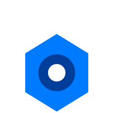

#  Hex Machina – AI Newsletter Service

**Hex Machina is a free, AI-driven newsletter service** that automatically monitors AI research, blogs, and announcements, summarizes key insights, and delivers **high-quality, concise newsletters**.

> AI News, Compiled by the Machine.

##  Overview

Keeping up with the **fast-moving AI landscape** is **time-consuming**. Traditional manual curation can’t scale.  
**Hex Machina solves this with automated intelligence.**

## ✔ Features & Scope

**Ingestion** → Ingests articles from AI-related websites.   

**Article Enrichment Flow** → Adds tags, summaries, etc...   

**Selection** → Selects most relevant items in an unsupervised way.   

**Newsletter Generator** → Compiles and formats weekly updates. (Not yet implemented)  

**Orchestration Script** → Runs the full pipeline automatically. (Not yet implemented)  

## 🏗 Technology Stack

| Component          | Technology                   |
|--------------------|------------------------------|
| Scraping           | Scrapy                       |
| Database           | TinyDB                       |
| LLMs               | OpenRouter / OpenAI          |
| Tagging & NLP      | Hugging Face / OpenAI        |
| Workflow           | Metaflow                     |
| Hosting            | Beehiiv                      |
| Ochestration       | Zapier                       |

## 📚 Documentation

[Hex Machina Documentation](docs/README.md)

## 💬 Contact & Support

For questions or contributions, contact **Mathieu Crilout** at <mathieu.crilout@gmail.com>.

## ⭐ Like this project?

If you find this useful, give it a ⭐ on **GitHub!** 😊

## 📜 License

The code is public, you can look at it, but this software is proprietary and owned by **Mathieu Crilout**.  
Unauthorized use, distribution, or modification is prohibited.