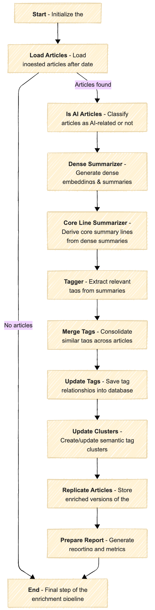
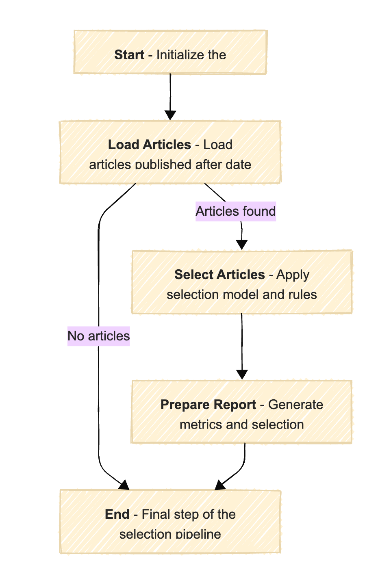

#  Hex Machina – AI Newsletter Documentation

Welcome to the documentation for the **Hex Machina** AI-powered newsletter system. This site includes system architecture, data models, class design, workflows, and more.

## 🧠 Technical Contents

Hex Machina is structured around three flows that each correspond to a key step in the system:

- [Article Ingestion Flow](../notebooks/article_ingestion_flow.ipynb)
- [Article Enrichment Flow](../notebooks/article_enrichment_flow.ipynb)
- [Article Selection Flow](../notebooks/article_selection_flow.ipynb)

Each notebook replicates its corresponding [Metaflow](https://metaflow.org/) pipeline in an interactive, testable environment using dummy data.

Please play with it !

## 🔁 Article Ingestion Flow

### Overview

The **Article Ingestion Flow** is responsible for fetching and preparing raw content from a variety of external sources. It forms the foundation of the Hex Machina pipeline by identifying, downloading, and standardizing articles into a uniform format suitable for further processing.


This flow is designed to be **modular**, **resumable**, and easy to test with dummy data. It is implemented using [Metaflow](https://metaflow.org/) to manage each step of the pipeline.

### Key Responsibilities

- 📥 **Collect** articles from selected sources (e.g., RSS feeds, curated lists)
- 🧹 **Normalize** the content into a standard schema for downstream enrichment
- 🗃️ **Store** raw content and metadata in a TinyDB database for traceability

---

### 🔧 Configuration

Before running the flow, update the configuration file at:

```bash
hex/config.yaml
```

```yaml
data_dir: ~/hex_machina/data         # Where all outputs and inputs are stored
db_path: ~/hex_machina/data/hex_tinydb.json  # Path to TinyDB article database
feeds_path: ~/hex_machina/data/rss_feeds.txt # List of standard RSS feed URLs (one per line)
feeds_stealth_path: ~/hex_machina/data/rss_feeds_stealth.txt # List of stealth-mode feeds (one per line)
```

### Try It Out

You can test and explore this flow interactively in the notebook:

[Article Ingestion Flow](../notebooks/article_ingestion_flow.ipynb)

## 🧪 Article Enrichment Flow


### Overview

The **Article Enrichment Flow** transforms raw, ingested articles into enriched, structured content ready for intelligent selection and presentation. It enhances the data by classifying, summarizing, tagging, and embedding each article — making them semantically searchable and more informative.



This flow builds on the ingestion process and prepares articles for the next stage using machine learning models, natural language processing, and metadata generation. Like all Hex Machina flows, it's implemented in [Metaflow](https://metaflow.org/) and can be tested easily with dummy inputs.

### Key Responsibilities

- 🧠 **Classify** articles by topic (e.g., AI, Business, Politics)
- ✂️ **Summarize** content into short, digestible blurbs
- 🏷️ **Generate tags** and keywords using semantic analysis
- 🧬 **Create embeddings** to capture article meaning for similarity and clustering

---

### 🔧 Configuration

The enrichment process relies on outputs from the ingestion step, and uses the following configuration in your `config.yaml` to get the db_path :

```bash
hex/config.yaml
```

You also need to set a .env file at the root of the repo. You must obtain a paid OPENROUTER_API_KEY and OPENAI_API_KEY.
Don’t worry — running the flow costs just a fraction of a cent per hundred articles.

```bash
.env
```

```yaml
OPENROUTER_API_KEY="your-openrouter-api-key"
OPENAI_API_KEY="your-openai-api-key"
```

### Try It Out

You can test and explore this flow interactively in the notebook:

[Article Enrichment Flow](../notebooks/article_enrichment_flow.ipynb)


## 🗞️ Article Selection Flow

### Overview

The **Article Selection Flow** is the final stage of the Hex Machina pipeline. It evaluates enriched articles and intelligently selects the most relevant and diverse subset to include in the newsletter. This ensures that each issue delivers high-quality, well-balanced content to readers.



This flow applies scoring heuristics, diversity constraints, and content filtering to produce a polished content bundle ready for rendering. Like all Hex Machina flows, it is orchestrated with [Metaflow](https://metaflow.org/) and can be run interactively or via CLI.

---

### 🎯 Key Responsibilities

- 🧹 **Filter** articles based on metadata (e.g., date, category, relevance)
- 📊 **Score** articles using heuristics (e.g., diversity, popularity, embedding distance)
- 🧮 **Rank & select** articles for inclusion, balancing topical and source diversity
- 🧾 **Package** selected articles into a structured newsletter-ready payload

### Try It Out

You can test and explore this flow interactively in the notebook:

[Article Selection Flow](../notebooks/article_selection_flow.ipynb)
