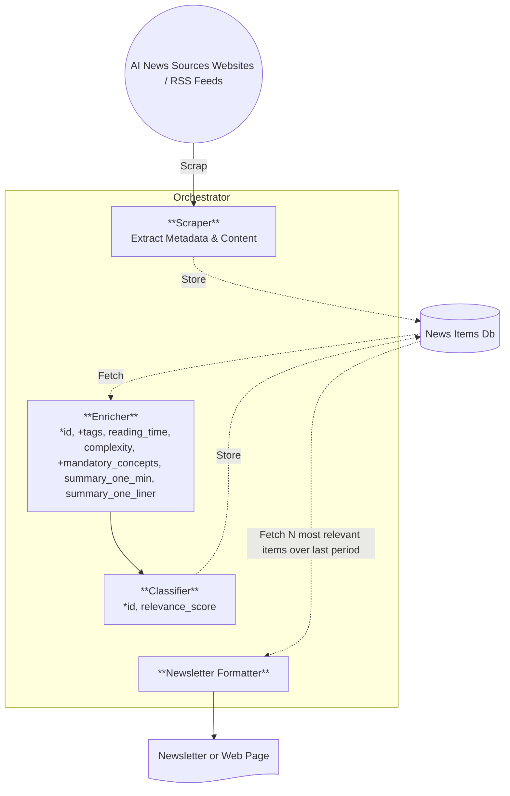

# 🏗️ System Architecture

## High-Level Diagram

```mermaid
flowchart TB
Scraper[**Scraper**
    Extract Metadata & Content
    ]
Enricher[**Enricher**
    *id, +tags, reading_time, complexity, +mandatory_concepts, summary_one_min, summary_one_liner
    ]
Classifier[**Classifier**
    *id, relevance_score
    ]
Newsletter_Formatter[**Newsletter Formatter**]
Sources((AI News Sources Websites / RSS Feeds)) -->|Scrap| Scraper
Newsletter_Formatter --> Output@{ shape: doc, label: "Newsletter or Web Page" }

subgraph Orchestrator
    Scraper
    Enricher --> Classifier
    Classifier ~~~ Newsletter_Formatter
end

Db[(News Items Db)]
Classifier -. Store .-> Db
Scraper -. Store .-> Db
Db -. Fetch .-> Enricher
Db -. Fetch N most relevant items over last period  .-> Newsletter_Formatter
```