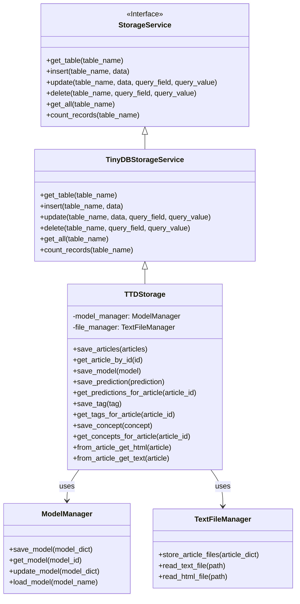
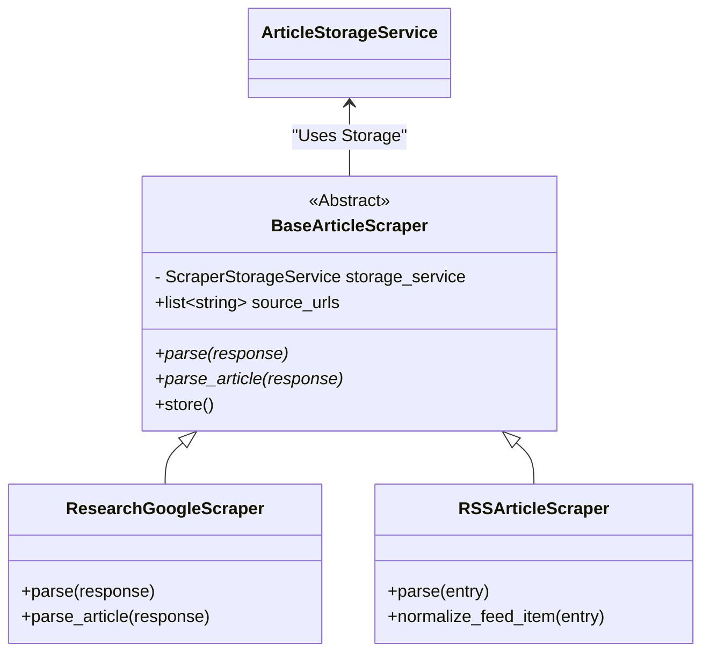

# 🧱 Class Design

## Storage Services

```mermaid
classDiagram
    %% ===== BASE STORAGE SERVICE =====
    class StorageService {
        <<Interface>>
        +get_table(table_name)
        +insert(table_name, data)
        +update(table_name, data, query_field, query_value)
        +delete(table_name, query_field, query_value)
        +get_all(table_name)
        +count_records(table_name)
    }

    %% ===== TINYDB STORAGE IMPLEMENTATION =====
    class TinyDBStorageService {
        +get_table(table_name)
        +insert(table_name, data)
        +update(table_name, data, query_field, query_value)
        +delete(table_name, query_field, query_value)
        +get_all(table_name)
        +count_records(table_name)
    }

    %% ===== TEXT FILE AND MODEL MANAGERS =====
    class ModelManager {
        +save_model(model_dict)
        +get_model(model_id)
        +update_model(model_dict)
        +load_model(model_name)
    }

    class TextFileManager {
        +store_article_files(article_dict)
        +read_text_file(path)
        +read_html_file(path)
    }

    %% ===== APP-SPECIFIC STORAGE WRAPPER =====
    class TTDStorage {
        +save_articles(articles)
        +get_article_by_id(id)
        +save_model(model)
        +save_prediction(prediction)
        +get_predictions_for_article(article_id)
        +save_tag(tag)
        +get_tags_for_article(article_id)
        +save_concept(concept)
        +get_concepts_for_article(article_id)
        +from_article_get_html(article)
        +from_article_get_text(article)
        -model_manager: ModelManager
        -file_manager: TextFileManager
    }

    %% ===== RELATIONSHIPS =====
    StorageService <|-- TinyDBStorageService
    TinyDBStorageService <|-- TTDStorage
    TTDStorage --> ModelManager : uses
    TTDStorage --> TextFileManager : uses
```

## Scrapers

```mermaid
classDiagram
    %% ===== BASE SCRAPER CLASS =====
    class BaseArticleScraper {
        <<Abstract>>
        - ScraperStorageService storage_service
        +list~string~ source_urls
        +parse(response)*
        +parse_article(response)*
        +store()
    }
    %% ===== GOOGLE RESEARCH SCRAPER =====
    class ResearchGoogleScraper {
        +parse(response)
        +parse_article(response)
    }
    %% ===== RSS ARTICLE SCRAPER =====
    class RSSArticleScraper {
        +parse(entry)
        +normalize_feed_item(entry)
    }
    %% ===== RELATIONSHIPS =====
    BaseArticleScraper <|-- ResearchGoogleScraper
    BaseArticleScraper <|-- RSSArticleScraper
    ArticleStorageService <-- BaseArticleScraper : "Uses Storage"
```

## Enrichers

```mermaid
classDiagram 
    %% ===== BASE ENRICHER CLASS =====
    class BaseEnricher {
        <<Abstract>>
        - ModelStorageService model_storage_service
        - PredictionsStorageService predictions_storage_service
        +enrich(items)*
        +store(predictions)*
    }
    
    %% ===== ENRICHMENT PIPELINE =====
    class EnricherPipeline {
        <<Service>>
        - list~BaseEnricher~ enrichers
        +add_enricher(enricher)
        +run_pipeline(inputs)
    }

    %% ===== TAGS ENRICHER =====
    class TagsEnricher {
        - ModelStorageService model_storage_service
        - PredictionsStorageService predictions_storage_service
        - TagsStorageService tags_storage_service
        +enrich(articles)
        +store(predictions)
    }

    %% ===== CONCEPTS ENRICHER =====
    class ConceptsEnricher {
        - ModelStorageService model_storage_service
        - PredictionsStorageService predictions_storage_service
        - ConceptsStorageService concepts_storage_service
        +enrich(articles)
        +store(predictions)
    }

    %% ===== SUMMARIZATION ENRICHERS =====
    class OneLineSummaryEnricher {
        - ModelStorageService model_storage_service
        - PredictionsStorageService predictions_storage_service
        +enrich(articles)
        +store(predictions)
    }

    class OneMinSummaryEnricher {
        - ModelStorageService model_storage_service
        - PredictionsStorageService predictions_storage_service
        +enrich(articles)
        +store(predictions)
    }

    %% ===== READING TIME ENRICHER =====
    class ReadingTimeEnricher {
        - ModelStorageService model_storage_service
        - PredictionsStorageService predictions_storage_service
        +enrich(articles)
        +store(predictions)
    }

    %% ===== ARTICLE CLASSIFIER =====
    class ArticleClassifier {
        - ModelStorageService model_storage_service
        - PredictionsStorageService predictions_storage_service
        +enrich(articles)
        +store(articles)
    }

    %% ===== RELATIONSHIPS =====
    BaseEnricher <|-- TagsEnricher
    BaseEnricher <|-- ConceptsEnricher
    BaseEnricher <|-- OneLineSummaryEnricher
    BaseEnricher <|-- OneMinSummaryEnricher
    BaseEnricher <|-- ReadingTimeEnricher
    BaseEnricher <|-- ArticleClassifier

    EnricherPipeline --* BaseEnricher : "Runs Enrichers"
```